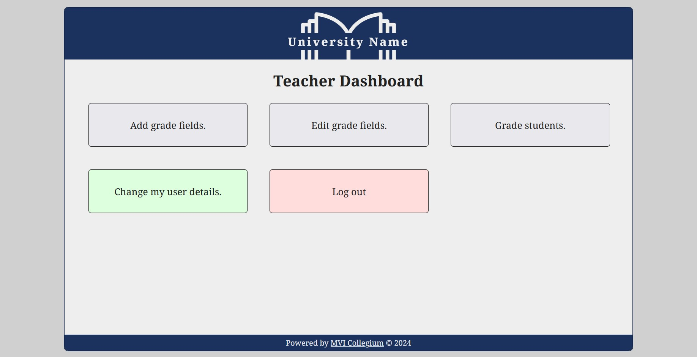

CSCB634_College
# MVI Collegium

A web information system and web app made with React and Spring that is meant for universities, colleges and other higher education institutions.

<!--  -->

## Developers

- **Simeon** - Back-End Development (User Logic, Security Configuration)<!--, Testing, Documentation -->
- **Vladislav** - Project Manager, Back-End Development, Database
- **Ivaylo** - Front-End Development, UI Design and Branding

## Folder Organization

- `/src` - Source code for the back-end.
- `/react_ui` - Source code for the front-end.
<!-- 
TODO: add documentation
- `/Documentation` - Project documentation.
-->

## Run the project locally

*Prerequisites: You must have jdk-17, npm and MySQL server installed and set up on your system.*

Then make sure your MySQL server username and password is configured correctly in the `application.yml` file located in `/src/main/resources`.


To run the **back-end** server, open a terminal in the root directory and execute the command:
```
.\mvnw spring-boot:run
```

Then, to run the **front-end** server, open another terminal in the `/react_ui` directory and execute the following commands:

```powershell
npm i #install dependencies
npm run dev #runs server in developer mode
```

You can then access the app at http://localhost:5173/.
